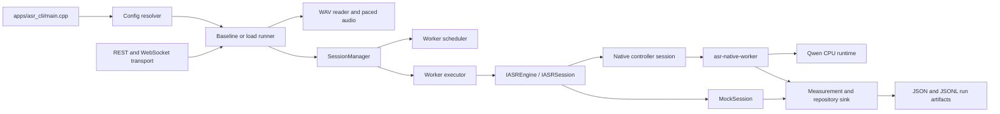

# ASR System Codebase Guide

This is a beginner-oriented map of the repository. Read it in order the first time:

1. [The one-minute mental model](#the-one-minute-mental-model)
2. [The complete request flow](#the-complete-request-flow)
3. [The interfaces](#the-interfaces)
4. [The modules and every source file](#the-modules-and-every-source-file)
5. [How to build and run it](#how-to-build-and-run-it)
6. [How to follow a real call in a debugger](#how-to-follow-a-real-call-in-a-debugger)

The guide describes the current source tree. It does not treat files under `build/`, `results/`, downloaded models, or prepared datasets as application source code.

## The one-minute mental model

The project is a CPU-only speech-recognition evaluation platform. It accepts either synthetic audio or a WAV file, converts the audio to the format required by the engine, sends it in time-sized chunks, receives partial/final transcript events, measures what happened, and writes an auditable run directory.

There are two engine choices:

- **Mock engine**: deterministic and model-free. It is used for fast tests and for checking the whole platform without a model.
- **Native Qwen engine**: a real Qwen3-ASR CPU adapter. The controller starts a separate native worker process for each call. The worker owns the vendor runtime and model context, which keeps a native crash or timeout isolated from the controller and other calls.

The most important design decision is the interface in [`engines/interfaces/include/asr/engines/engine.hpp`](../engines/interfaces/include/asr/engines/engine.hpp): the rest of the system talks to `IASREngine`, `IASRSession`, and `IRecognitionSink`, not directly to Qwen or the mock implementation.



## The complete request flow

### 1. A command enters at the CLI

[`apps/asr_cli/main.cpp`](../apps/asr_cli/main.cpp) is the composition root. A composition root is the place where independent parts are assembled into a working application.

The command is one of:

- `validate`: resolve and validate configuration; do not run audio.
- `dry-run`: resolve configuration and show what a normal run would use.
- `run`: perform one baseline call.
- `load-dry-run`: plan a multi-call load run without starting it.
- `load`: execute a planned load run.
- `sweep-dry-run`: enumerate sweep cases and skip reasons.
- `sweep`: execute selected or generated cases.
- `serve`: expose the same runner through the local API and WebSocket service.

The CLI parses command-line values, calls `resolve_config`, chooses the engine, creates the manager, and dispatches to the baseline/load/sweep/service code. This is wiring; the detailed behavior lives in the modules below it.

### 2. Configuration becomes a typed `RunConfig`

[`configs/src/config.cpp`](../configs/src/config.cpp) starts with defaults, merges one YAML file, then applies `--set section.key=value` overrides. The order is:

```text
built-in defaults -> YAML file -> command-line overrides -> validation -> RunConfig
```

Unknown keys, duplicate YAML keys, invalid ranges, unsupported languages, non-CPU devices, invalid audio formats, and unsafe native settings are rejected before a run starts. The resolved JSON is persisted so a result can be reproduced from what the program actually used rather than from memory of the command line.

### 3. The runner prepares the audio

[`benchmark/src/baseline.cpp`](../benchmark/src/baseline.cpp) is the single-call path used by CLI runs and by higher-level load execution.

- Synthetic input is generated in memory.
- WAV input is read and normalized by [`audio/src/wav.cpp`](../audio/src/wav.cpp).
- The required engine input is mono, 16 kHz, signed PCM16.
- The WAV reader handles classic RIFF/WAVE PCM and float input, channel selection/mixing, and resampling.
- The WAV file is prepared before the paced measurement interval, so file decoding time is not confused with streaming time.

`PacedAudioStream` in [`audio/src/delivery.cpp`](../audio/src/delivery.cpp) then makes chunks available at absolute sample deadlines. A 200 ms chunk at 16 kHz contains 3,200 samples. The first full chunk is not available at time zero; it becomes available after its scheduled audio duration. This prevents a fast disk read from pretending that real-time audio arrived instantly.

### 4. The manager admits and owns a session

`SessionManager::create_session` selects a healthy, free worker using either least-active or round-robin scheduling. It assigns a unique call ID and worker-generation ID, creates the engine for that slot, and returns a `ManagedSession`.

The current policy is intentionally conservative:

- one active session per process;
- one inference slot per process;
- one model instance per process;
- native calls use process isolation;
- mock calls use an in-process executor;
- idle and total deadlines are watched by the manager;
- a worker failure marks that slot unhealthy and emits a failed event.

`ManagedSession` forwards audio and lifecycle operations to the actual engine session while adding worker identity, state tracking, timeout handling, and cleanup.

### 5. The engine consumes chunks and emits events

Every engine implements the same lifecycle:

```text
create_session -> submit(chunk) ... -> finish_input()
                              \-> cancel(reason)
```

The engine calls `IRecognitionSink::on_event` for partial, final, stopped, or failed recognition events. It may also call `on_observation` for runtime timings and resource observations.

The mock updates a deterministic text snapshot based on language, seed, and samples consumed. The native controller serializes PCM frames to a child process and reads newline-delimited JSON events back. The child process converts PCM16 to the Qwen live-buffer format, invokes the vendor runtime, and reports partial/final/timing messages.

### 6. The sink records evidence

`RepositorySink` in [`benchmark/src/baseline.cpp`](../benchmark/src/baseline.cpp) is the bridge from live callbacks to measurement/storage:

- stamps the publication time when the controller receives an event;
- stores all events and observations in `CallMeasurements`;
- appends event JSONL and timing JSONL to the repository;
- counts events and finals;
- requires exactly one successful final event.

The repository writes `summary.json`, `status.json`, `events.jsonl`, `audio_timing.jsonl`, and additional streams such as `runtime_timing.jsonl`, `system_metrics.jsonl`, `calls.jsonl`, `workers.jsonl`, and `errors.jsonl`.

### 7. Metrics summarize the call

[`observability/src/metrics.cpp`](../observability/src/metrics.cpp) computes latency distributions and explicitly distinguishes measured values from unavailable internal boundaries. For example, effective RTF includes paced waiting and EOF refinement; it is not claimed to be pure model compute RTF. Percentiles use a documented type-7 interpolation and are not silently pooled across unrelated calls.

[`observability/src/system_sampler.cpp`](../observability/src/system_sampler.cpp) samples Linux `/proc` data for the controller and descendants. It records process CPU ticks, threads, RSS/PSS/USS where available, CPU affinity, host memory, swap counters, and process-tree CPU equivalents. Sampling is bounded and a critical telemetry failure can fail the run.

### 8. Load and sweep runs reuse the same path

[`benchmark/src/load.cpp`](../benchmark/src/load.cpp) creates a deterministic plan, performs resource/disk/time preflight, separates warmups from measured repetitions, starts calls with optional staggering, and aggregates results. It can use direct calls or the loopback WebSocket boundary.

[`benchmark/src/sweep.cpp`](../benchmark/src/sweep.cpp) creates baseline, selected, one-factor-at-a-time, bounded matrix, or concurrency-scale cases. Unsupported cases become explicit `SKIPPED` rows. Scale runs find and refine a pass/fail boundary, but the project does not claim a formal production capacity estimate from that alone.

### 9. The service exposes the same behavior

`serve` creates the same manager and suite executor used by the CLI. [`backend/transport/src/api_service.cpp`](../backend/transport/src/api_service.cpp) handles versioned REST routes for capabilities, configuration resolution, history, artifacts, reports, suites, jobs, and stop requests.

[`backend/transport/src/websocket.cpp`](../backend/transport/src/websocket.cpp) implements the loopback WebSocket protocol, including masked client frames, bounded frame sizes, origin checks, PCM sequence checks, EOF, ACK/credit flow control, and an observation replay feed. The service is a local prototype: it does not claim TLS, authentication, remote exposure, durable job storage, or production retention policy.

## The interfaces

These are the contracts to understand before reading implementations.

### Core data types

[`core/include/asr/core/types.hpp`](../core/include/asr/core/types.hpp) defines the vocabulary shared by all modules:

- `ErrorCode`, `Status`, and `Result<T>`: explicit success/failure without using exceptions for ordinary engine outcomes.
- `SessionState`: `creating`, `ready`, `streaming`, `finalizing`, `completed`, `stopped`, `failed`.
- `EventKind`: `partial`, `final`, `stopped`, `failed`.
- `AudioChunk`: run/call identity, sequence, first sample, format, timing, and immutable PCM data.
- `RecognitionEvent`: transcript snapshot, revision, timestamps, consumed samples, event kind, and status.
- `RuntimeObservation`: an optional timing/resource observation independent of vendor types.
- `SessionConfig`: per-call language, seed, sample rate, partial interval, and chunk limit.
- `SessionSnapshot`: current state, worker, consumed samples, revision, and text.
- `EngineCapabilities`: engine identity, device, precision, languages, streaming semantics, and verified feature flags.

### Time

[`core/include/asr/core/clock.hpp`](../core/include/asr/core/clock.hpp) defines `IClock`:

- `now_ns()` supplies a monotonic timestamp;
- `sleep_until_ns()` supports deterministic deadline-based pacing;
- `domain()` labels timestamps such as `host_steady` or `simulated`;
- `utc_now()` optionally supplies wall-clock display time.

`SteadyClock` is used for real measurements. `FakeClock` advances immediately and makes tests fast and deterministic. The code uses monotonic time for durations and UTC only as optional metadata.

### Engine and session

[`engines/interfaces/include/asr/engines/engine.hpp`](../engines/interfaces/include/asr/engines/engine.hpp) defines three key interfaces:

`IRecognitionSink` is a callback destination. An engine pushes events to `on_event` and may push runtime observations to `on_observation`.

`IASRSession` is one call. The caller submits ordered chunks, finishes input exactly once, or cancels. Calls are serialized by contract, and callbacks must not outlive the session.

`IASREngine` is an engine factory. It reports capabilities and creates independent sessions from a `SessionConfig`, sink, and clock. This is the substitution point used by mock and native implementations.

### Audio source and delivery

[`audio/include/asr/audio/source.hpp`](../audio/include/asr/audio/source.hpp) defines `IAudioSource`, which supplies prepared PCM samples. It also has a synthetic source for tests.

[`audio/include/asr/audio/wav.hpp`](../audio/include/asr/audio/wav.hpp) defines the WAV reader result and `SincResampler`.

[`audio/include/asr/audio/delivery.hpp`](../audio/include/asr/audio/delivery.hpp) defines `PacedAudioStream`, `AudioTiming`, `DeliveryStats`, `DeliveryState`, and delivery limits. It is responsible for timing and bounded buffering, not recognition.

### Worker execution and scheduling

[`backend/workers/include/asr/backend/executor.hpp`](../backend/workers/include/asr/backend/executor.hpp) defines `IWorkerExecutor`: an abstraction for making one engine instance for a worker slot. `FactoryWorkerExecutor` records whether that engine is `in_process` or `process` and calls a factory.

[`backend/scheduler/include/asr/backend/scheduler.hpp`](../backend/scheduler/include/asr/backend/scheduler.hpp) defines `WorkerSnapshot` and `IWorkerScheduler`. `LeastActiveScheduler` chooses the least active available worker. `RoundRobinScheduler` rotates through available workers.

[`backend/sessions/include/asr/backend/session_manager.hpp`](../backend/sessions/include/asr/backend/session_manager.hpp) defines `WorkerLayout` and `SessionManager`. `SessionManager` itself implements `IASREngine`, so higher layers can use it exactly like a normal engine while receiving scheduling and isolation.

### Storage

[`storage/include/asr/storage/repository.hpp`](../storage/include/asr/storage/repository.hpp) defines `IResultRepository` with `begin`, `append`, `append_audio`, `append_record`, and `finish`. `MemoryResultRepository` is useful for tests. `FileResultRepository` is the durable flat-file implementation used by runs.

### Measurement

[`observability/include/asr/observability/metrics.hpp`](../observability/include/asr/observability/metrics.hpp) defines `CallMeasurements`, percentile summaries, and JSON conversion for observations.

[`observability/include/asr/observability/system_sampler.hpp`](../observability/include/asr/observability/system_sampler.hpp) defines `ISystemSampler`, `LinuxSystemSampler`, and `ResourceMonitor`. The interface allows tests to replace Linux `/proc` sampling with a controlled sampler.

## The modules and every source file

### Root build and dependency files

- [`CMakeLists.txt`](../CMakeLists.txt): declares C++20, warnings, libraries, executables, optional native Qwen targets, and every CTest test. Read this to see dependency direction.
- [`CMakePresets.json`](../CMakePresets.json): names the model-free `dev-mock` and native `release-cpu` configure/build presets.
- [`cmake/FoundationDependencies.cmake`](../cmake/FoundationDependencies.cmake): obtains or locates pinned foundational dependencies such as yaml-cpp and nlohmann/json.
- [`cmake/NativeQwen.cmake`](../cmake/NativeQwen.cmake): configures the pinned CPU-only Qwen native dependency.
- [`THIRD_PARTY_NOTICES.md`](../THIRD_PARTY_NOTICES.md): records third-party dependency/license notices.

### Core

- [`core/include/asr/core/types.hpp`](../core/include/asr/core/types.hpp): shared states, errors, audio chunks, recognition events, observations, session settings, snapshots, and capabilities.
- [`core/include/asr/core/clock.hpp`](../core/include/asr/core/clock.hpp): real and fake clocks plus UTC formatting.
- [`core/include/asr/core/chunk_schedule.hpp`](../core/include/asr/core/chunk_schedule.hpp): converts samples and chunk durations to integer-safe nanosecond/sample offsets. This prevents cumulative sleep drift and rounding surprises.

There is no `.cpp` file for core because these small contracts and helpers are header-only.

### Audio

- [`audio/include/asr/audio/source.hpp`](../audio/include/asr/audio/source.hpp): source abstraction and synthetic PCM source.
- [`audio/include/asr/audio/wav.hpp`](../audio/include/asr/audio/wav.hpp): WAV metadata, prepared audio, and resampler declarations.
- [`audio/include/asr/audio/delivery.hpp`](../audio/include/asr/audio/delivery.hpp): paced stream and queue contract.
- [`audio/src/wav.cpp`](../audio/src/wav.cpp): validates RIFF/WAVE input, decodes supported sample formats, mixes channels, resamples, and produces mono PCM16.
- [`audio/src/delivery.cpp`](../audio/src/delivery.cpp): implements absolute-deadline chunk production, queue bounds, lag/overflow tracking, EOF, draining, and cancellation.
- [`audio/README.md`](../audio/README.md): short module-level explanation and boundaries.

### Engine interfaces and engines

- [`engines/interfaces/include/asr/engines/engine.hpp`](../engines/interfaces/include/asr/engines/engine.hpp): engine/session/sink contracts.
- [`engines/mock/include/asr/engines/mock_engine.hpp`](../engines/mock/include/asr/engines/mock_engine.hpp): declaration of the deterministic mock engine.
- [`engines/mock/src/mock_engine.cpp`](../engines/mock/src/mock_engine.cpp): validates session settings, accepts ordered PCM, emits deterministic partials, emits one final, and handles cancellation.
- [`engines/native/include/asr/engines/native_engine.hpp`](../engines/native/include/asr/engines/native_engine.hpp): native engine options and public adapter declaration.
- [`engines/native/src/native_engine.cpp`](../engines/native/src/native_engine.cpp): controller-side native session. It starts the worker, writes framed PCM, polls worker JSON, maps partial/final/timing messages, enforces watchdog behavior, and kills/reaps failed children.
- [`engines/native/src/wire.hpp`](../engines/native/src/wire.hpp): small binary frame definition shared by native controller and worker.
- [`engines/native/src/worker_main.cpp`](../engines/native/src/worker_main.cpp): child process entry point. It owns Qwen headers/context, reads fd 3, validates frame sequence, converts samples to floats, invokes the live runtime, preserves UTF-8 token fragments, and emits newline-delimited JSON.
- [`engines/README.md`](../engines/README.md): engine boundary and capability notes.

The native adapter deliberately keeps vendor headers in the worker implementation. The rest of the application only sees the stable engine interface.

### Backend workers, scheduling, and sessions

- [`backend/workers/include/asr/backend/executor.hpp`](../backend/workers/include/asr/backend/executor.hpp): executor contract and factory executor.
- [`backend/workers/src/executor.cpp`](../backend/workers/src/executor.cpp): validates executor kind and creates engine instances.
- [`backend/scheduler/include/asr/backend/scheduler.hpp`](../backend/scheduler/include/asr/backend/scheduler.hpp): worker state and scheduler interface.
- [`backend/scheduler/src/scheduler.cpp`](../backend/scheduler/src/scheduler.cpp): least-active and round-robin selection algorithms.
- [`backend/sessions/include/asr/backend/session_manager.hpp`](../backend/sessions/include/asr/backend/session_manager.hpp): manager public API, worker layout, draining, reset, and snapshots.
- [`backend/sessions/src/session_manager.cpp`](../backend/sessions/src/session_manager.cpp): managed-session implementation, callback forwarding, worker generations, admission, deadlines, state transitions, final-count enforcement, and slot release.
- [`backend/README.md`](../backend/README.md): backend design summary.

The important ownership rule is that `ManagedSession` destroys the inner engine session before releasing its worker slot. That prevents a stale native process or callback from being reused under a new call identity.

### Configuration

- [`configs/include/asr/config/config.hpp`](../configs/include/asr/config/config.hpp): `RunConfig` and the `resolve_config` declaration.
- [`configs/src/config.cpp`](../configs/src/config.cpp): defaults, YAML schema merge, CLI override parsing, validation, path resolution, and resolved configuration construction.
- [`configs/mock_baseline.yaml`](../configs/mock_baseline.yaml): model-free example configuration.
- [`configs/qwen_native_single.yaml`](../configs/qwen_native_single.yaml): single-call native example configuration.
- [`configs/README.md`](../configs/README.md): configuration fields and command examples.

### Benchmark and experiment runner

- [`benchmark/include/asr/benchmark/baseline.hpp`](../benchmark/include/asr/benchmark/baseline.hpp): single-call runner API.
- [`benchmark/src/baseline.cpp`](../benchmark/src/baseline.cpp): connects source, pacing, manager/engine, sink, repository, resource monitor, and summary generation.
- [`benchmark/include/asr/benchmark/load.hpp`](../benchmark/include/asr/benchmark/load.hpp): load specification, plan, call, preflight, and execution declarations.
- [`benchmark/src/load.cpp`](../benchmark/src/load.cpp): bounded load planning, memory/disk/time preflight, seeded language/call assignment, warmups, repetitions, concurrency, SLO checks, and suite artifacts.
- [`benchmark/include/asr/benchmark/sweep.hpp`](../benchmark/include/asr/benchmark/sweep.hpp): sweep strategy and case declarations.
- [`benchmark/src/sweep.cpp`](../benchmark/src/sweep.cpp): case generation, effective-config checks, skip reasons, checkpointing, scale refinement, and aggregate sweep results.
- [`benchmark/README.md`](../benchmark/README.md): experiment behavior and evidence limits.

### Observability

- [`observability/include/asr/observability/metrics.hpp`](../observability/include/asr/observability/metrics.hpp): call measurement structures and summary APIs.
- [`observability/src/metrics.cpp`](../observability/src/metrics.cpp): event timing, finalization, effective RTF, latency distributions, queue metrics, and explicit unavailable-boundary notes.
- [`observability/include/asr/observability/system_sampler.hpp`](../observability/include/asr/observability/system_sampler.hpp): sampler and monitor contracts.
- [`observability/src/system_sampler.cpp`](../observability/src/system_sampler.cpp): Linux `/proc` implementation and bounded background sampling.
- [`observability/README.md`](../observability/README.md): metric definitions and limitations.

### Storage

- [`storage/include/asr/storage/repository.hpp`](../storage/include/asr/storage/repository.hpp): repository interface and memory/file implementations.
- [`storage/src/repository.cpp`](../storage/src/repository.cpp): event/status serialization, environment capture, run ID generation, atomic status writes, JSONL streams, and final summaries.
- [`storage/README.md`](../storage/README.md): artifact layout and storage rules.

### Transport and service

- [`backend/transport/include/asr/backend/api_service.hpp`](../backend/transport/include/asr/backend/api_service.hpp): HTTP request/response types, suite callback, job/service API, and admission gate integration.
- [`backend/transport/include/asr/backend/service_gate.hpp`](../backend/transport/include/asr/backend/service_gate.hpp): coordination between interactive calls and suite jobs.
- [`backend/transport/include/asr/backend/websocket.hpp`](../backend/transport/include/asr/backend/websocket.hpp): server entry point and streaming service declarations.
- [`backend/transport/src/api_service.cpp`](../backend/transport/src/api_service.cpp): REST routing, safe artifact access, config resolution, asynchronous jobs, idempotency keys, job status, and cooperative stop.
- [`backend/transport/src/websocket.cpp`](../backend/transport/src/websocket.cpp): HTTP upgrade, WebSocket frame parsing/writing, origin and size checks, binary PCM protocol, ACK credits, EOF handling, and observation replay.
- [`backend/transport/README.md`](../backend/transport/README.md): protocol and security boundary notes.

### CLI application

- [`apps/asr_cli/main.cpp`](../apps/asr_cli/main.cpp): command parsing, strict scalar parsing, config loading, engine/manager construction, baseline/load/sweep dispatch, and server startup.
- [`apps/README.md`](../apps/README.md): entry-point status. The repository currently has one implemented CLI composition root; older reserved application names in this README are not separate current executables.

### Evaluation and Python tooling

- [`evaluation/scoring.py`](../evaluation/scoring.py): Unicode normalization, WER/CER-style edit accounting, alignment, and score structures.
- [`evaluation/README.md`](../evaluation/README.md): evaluation conventions.
- [`tools/datasets/make_edge_fixtures.py`](../tools/datasets/make_edge_fixtures.py): creates deterministic silence/boundary fixtures.
- [`tools/datasets/prepare_fleurs.py`](../tools/datasets/prepare_fleurs.py): prepares the initial FLEURS subset/manifests.
- [`tools/datasets/prepare_m4_fleurs.py`](../tools/datasets/prepare_m4_fleurs.py): prepares the M4 tuning and held-out cohorts.
- [`tools/models/acquire_model.py`](../tools/models/acquire_model.py): downloads/acquires the pinned model and verifies its hash.
- [`tools/evaluation/run_measured.py`](../tools/evaluation/run_measured.py): orchestrates measured native runs from Python around the C++ executable.
- [`tools/evaluation/audit_measured.py`](../tools/evaluation/audit_measured.py): checks measured artifacts and consistency.
- [`tools/reference/qwen_reference.py`](../tools/reference/qwen_reference.py): invokes the pinned official/reference Qwen environment.
- [`tools/reference/scoring.py`](../tools/reference/scoring.py): reference-side scoring support.
- [`tools/reference/compare_native.py`](../tools/reference/compare_native.py): compares native output with reference/human data.
- [`tools/reference/check_gate.py`](../tools/reference/check_gate.py): verifies predeclared acceptance gates.
- [`tools/reference/validate_live.py`](../tools/reference/validate_live.py): validates live native behavior over prepared clips.
- [`tools/reference/validate_m3_adapter.py`](../tools/reference/validate_m3_adapter.py): validates the M3 adapter cohort.
- [`tools/reference/setup_reference.sh`](../tools/reference/setup_reference.sh): creates the pinned Python reference environment.
- [`scripts/doctor.py`](../scripts/doctor.py): reports environment/build prerequisites.
- [`scripts/fetch_foundation.sh`](../scripts/fetch_foundation.sh): fetches foundation dependencies.
- [`scripts/fetch_native.sh`](../scripts/fetch_native.sh): fetches/builds the native dependency.
- [`scripts/fetch_reference.sh`](../scripts/fetch_reference.sh): fetches reference assets/environment pieces.

### Research probes

- [`research/native_qwen/probe.cpp`](../research/native_qwen/probe.cpp): standalone native Qwen streaming probe used before the production adapter existed.
- [`research/native_qwen/lifecycle.cpp`](../research/native_qwen/lifecycle.cpp): standalone context create/free/lifecycle diagnostic.
- [`research/native_qwen/run_probe.py`](../research/native_qwen/run_probe.py): Python wrapper for repeatable probe execution and artifact capture.
- [`research/native_qwen/run_lifecycle.py`](../research/native_qwen/run_lifecycle.py): Python wrapper for lifecycle diagnostics.

These probes are useful for runtime investigation but are not the normal `asr-cli` architecture. The main application path is the native adapter plus isolated worker.

### Tests

- [`tests/unit/chunk_schedule_test.cpp`](../tests/unit/chunk_schedule_test.cpp): sample-to-time and chunk-size rules.
- [`tests/unit/audio_test.cpp`](../tests/unit/audio_test.cpp): WAV conversion and paced delivery contracts.
- [`tests/unit/foundation_test.cpp`](../tests/unit/foundation_test.cpp): core/config/storage/foundation contracts.
- [`tests/unit/session_manager_test.cpp`](../tests/unit/session_manager_test.cpp): simultaneous languages, admission, reset, worker failure, queue behavior, and deadlines.
- [`tests/unit/measurement_test.cpp`](../tests/unit/measurement_test.cpp): known timing/metric calculations and telemetry failure behavior.
- [`tests/unit/load_test.cpp`](../tests/unit/load_test.cpp): load planning, preflight, SLO behavior, and cancellation contracts.
- [`tests/unit/sweep_test.cpp`](../tests/unit/sweep_test.cpp): sweep case generation, skip behavior, and scale refinement.
- [`tests/integration/audio_realtime_60.cpp`](../tests/integration/audio_realtime_60.cpp): real-clock 60-second pacing gate.
- [`tests/integration/cli_contract.cmake`](../tests/integration/cli_contract.cmake): CLI artifact contract checks.
- [`tests/integration/api_service_test.cpp`](../tests/integration/api_service_test.cpp): REST routes, jobs, idempotency, and stop behavior.
- [`tests/integration/websocket_test.cpp`](../tests/integration/websocket_test.cpp): WebSocket protocol, masking, ACK/EOF, disconnects, and observations.
- [`tests/integration/native_worker_stub.cpp`](../tests/integration/native_worker_stub.cpp): fake child worker for native adapter contract tests.
- [`tests/integration/native_adapter_test.cpp`](../tests/integration/native_adapter_test.cpp): controller/worker native protocol behavior without a real model.
- [`tests/integration/native_manager_test.cpp`](../tests/integration/native_manager_test.cpp): native adapter plus session manager lifecycle.
- [`tests/unit/scoring_test.py`](../tests/unit/scoring_test.py): Python scoring normalization and edit counts.
- [`tests/unit/evaluation_test.py`](../tests/unit/evaluation_test.py): evaluation workflow tests.
- [`tests/unit/m4_workflow_test.py`](../tests/unit/m4_workflow_test.py): measured-workflow/audit checks.
- [`tests/README.md`](../tests/README.md): test commands and model-free/native test boundaries.

Tests are not only correctness checks; they are executable examples of the intended contract. When learning a class, read its nearest test after reading its header.

### Documentation-only and reserved areas

- [`docs/IMPLEMENTATION_STATUS.md`](IMPLEMENTATION_STATUS.md): current milestone evidence and explicit evidence limits.
- [`docs/planning/IMPLEMENTATION_PLAN.md`](planning/IMPLEMENTATION_PLAN.md): intended milestone sequence and original scope.
- [`docs/architecture-diagrams.md`](architecture-diagrams.md): architecture diagrams.
- [`docs/m0-code.md`](m0-code.md) through [`docs/m7-code.md`](m7-code.md): milestone-specific code maps and commands.
- [`docs/decisions/`](decisions/): architecture decision records and predeclared gates.
- [`reports/README.md`](../reports/README.md), [`microbenchmarks/README.md`](../microbenchmarks/README.md), and [`schemas/README.md`](../schemas/README.md): reserved/reporting/schema notes; they are not the live web UI.
- [`frontend/README.md`](../frontend/README.md): frontend status. The current repository does not contain a React/Vite application implementation; the backend service is the implemented M7 boundary.

## How to build and run it

The exact dependency/bootstrap details are in the root [`README.md`](../README.md) and module READMEs. The conceptual sequence is:

```bash
# From the repository root
cmake --preset dev-mock
cmake --build --preset dev-mock
ctest --preset dev-mock --output-on-failure

# Validate and run the model-free example
build/dev-mock/asr-cli validate --config configs/mock_baseline.yaml
build/dev-mock/asr-cli dry-run --config configs/mock_baseline.yaml
build/dev-mock/asr-cli run --config configs/mock_baseline.yaml
```

For the native build, use the repository's `release-cpu` preset after the pinned native dependency and model are available:

```bash
cmake --preset release-cpu
cmake --build --preset release-cpu
ctest --preset release-cpu --output-on-failure
build/release-cpu/asr-cli run --config configs/qwen_native_single.yaml
```

The build names are preset-defined; if a local CMake version reports a preset-specific difference, inspect `CMakePresets.json` rather than guessing a build directory.

Useful planning commands:

```bash
build/dev-mock/asr-cli load-dry-run --config configs/mock_baseline.yaml \
  --calls 3 --concurrency 2 --languages en,id,zh

build/dev-mock/asr-cli sweep-dry-run --config configs/mock_baseline.yaml \
  --strategy oat --axis audio.chunk_ms=100,200,400
```

`validate` and dry-run commands should not create measured run artifacts. A real run creates a unique directory beneath the configured output directory.

## How to follow a real call in a debugger

For a beginner, use the mock path first because it has no model startup delay and no child process.

Set breakpoints in this order:

1. [`apps/asr_cli/main.cpp`](../apps/asr_cli/main.cpp): find `resolve_config`, `make_manager`, and the command dispatch.
2. [`configs/src/config.cpp`](../configs/src/config.cpp): watch defaults, YAML merge, overrides, and validation.
3. [`benchmark/src/baseline.cpp`](../benchmark/src/baseline.cpp): enter `run_baseline` and `RepositorySink::on_event`.
4. [`audio/src/delivery.cpp`](../audio/src/delivery.cpp): inspect `produce_ready`, `pop`, and `finish_input`.
5. [`backend/sessions/src/session_manager.cpp`](../backend/sessions/src/session_manager.cpp): inspect `create_session`, `ManagedSession::submit`, and `finish_input`.
6. [`engines/mock/src/mock_engine.cpp`](../engines/mock/src/mock_engine.cpp): inspect `MockSession::submit`, `finish_input`, and `emit`.
7. [`storage/src/repository.cpp`](../storage/src/repository.cpp): inspect event serialization and `FileResultRepository::finish`.

For the native path, repeat the same route and then move to:

1. `NativeSession::spawn` and `NativeSession::submit` in [`engines/native/src/native_engine.cpp`](../engines/native/src/native_engine.cpp).
2. `main`, `read_audio`, and `token_callback` in [`engines/native/src/worker_main.cpp`](../engines/native/src/worker_main.cpp).
3. The JSON event handling in `NativeSession::handle_line`.

The native controller and worker communicate through a binary PCM/EOF input stream and newline-delimited JSON output. A native worker is a separate operating-system process, so a debugger attached only to `asr-cli` will not automatically stop inside the worker.

## Artifact reading order

After a run, read these files in this order:

1. `status.json`: whether the run is still running, complete, or failed.
2. `resolved_config.json` or `config.json`: what settings were actually used.
3. `summary.json`: the high-level result and metric definitions.
4. `events.jsonl`: every partial/final/stopped/failed recognition event.
5. `audio_timing.jsonl`: scheduled, read, queued, dequeued, sent, and lag timing for each chunk.
6. `runtime_timing.jsonl`: worker/runtime observations.
7. `system_metrics.jsonl`: raw Linux resource samples when sampling was enabled.
8. `calls.jsonl`, `workers.jsonl`, and `errors.jsonl`: load-level call/worker/error records.

For a suite, start with `plan.json`, then `status.json`, then the suite summary and its child run directories. Never infer a capacity claim from a single summary without checking the plan, preflight, population size, failures, and evidence limits.

## What is implemented and what is not claimed

The source contains a functioning M0-M7 prototype: model-free tests, native CPU integration, single-call measurement, isolated session management, load/sweep planning, and a local REST/WebSocket service. The status document is the authority for measured evidence.

Important boundaries:

- The native process-isolated worker is a prototype, not production hardening.
- The service is loopback-oriented and has no TLS/authentication/remote-client support claim.
- Large native sweeps, multi-model saturation, official production accuracy, long endurance, and formal capacity sizing remain evidence gaps unless a specific result says otherwise.
- The frontend directory has documentation but no implemented React/Vite dashboard in the current source inventory.
- A mock transcript proves plumbing, not speech-recognition accuracy.

When in doubt, distinguish these three words:

- **implemented**: code and tests exist;
- **verified**: a documented test or run exercised it;
- **qualified**: enough representative evidence exists to make a production or capacity claim.

The repository often implements more than it has qualified. That distinction is deliberate and is part of the experiment design.
